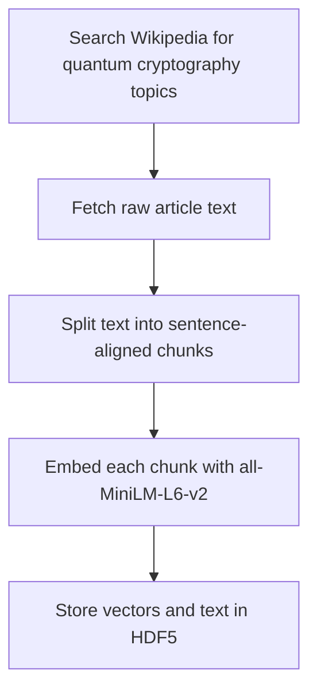
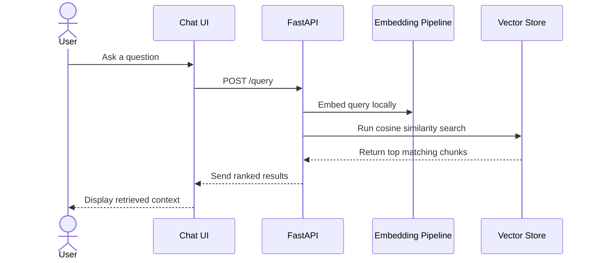

# Quantum Cryptography RAG

Quantum Cryptography RAG is a local-first retrieval application built to answer questions over a focused knowledge base of Wikipedia content about quantum cryptography and adjacent topics.

The project was built from first principles on purpose. It does not rely on orchestration frameworks or vector databases. Retrieval, embeddings, similarity search, persistence, API delivery, and the browser experience are all implemented directly in the codebase using standard libraries such as `transformers`, `torch`, `numpy`, `h5py`, `FastAPI`, and vanilla HTML/JavaScript.

## Why This Project Exists

Most RAG demos hide the hard parts behind abstraction layers. This project does the opposite.

It is designed to show what a localized RAG system looks like when each layer is explicit:

- article discovery and ingestion
- sentence-aware chunking
- local embedding generation
- manual mean pooling
- pure NumPy similarity search
- HDF5 persistence
- a small API surface
- a simple chat interface

The result is a system that is easy to reason about, easy to inspect, and practical to run locally or in Docker.

## What The System Does

At a high level, the application turns a set of Wikipedia articles into a searchable local knowledge base, then exposes that knowledge base through a lightweight chat-style UI.


There are two distinct flows in the product.

### 1. Build The Knowledge Base

The offline pipeline collects source material, breaks it into retrieval-friendly chunks, generates embeddings locally, and persists the results so the application can start quickly later.



### 2. Answer A Query

At runtime, the application embeds the user’s question locally, runs cosine similarity search against the persisted vectors, and returns the most relevant chunks to the frontend.



## What Makes It Different

- Local by design. The embedding model runs on your machine and the persisted store lives on disk.
- Minimal by design. There is no LangChain, LlamaIndex, FAISS, ChromaDB, or `sentence-transformers`.
- Transparent by design. Mean pooling and cosine similarity are implemented directly, so the math is visible in the code.
- Practical by design. The app ships with a FastAPI backend, a browser UI, and Docker support.

## Retrieval Design

The corpus is built from Wikipedia articles related to quantum cryptography. Text is chunked with sentence boundaries preserved, then embedded with `sentence-transformers/all-MiniLM-L6-v2` loaded through raw `transformers`.

The chunking strategy follows a sentence-aligned contract:

- chunks do not cut sentences
- each chunk stays within a 500-token ceiling
- overlap targets roughly 50 tokens while staying sentence-aligned

That tradeoff is intentional. Exact token overlap and strict sentence integrity are not always simultaneously possible when sentence lengths vary, so the implementation optimizes for readable, consistent chunks rather than artificial precision.

## Embeddings And Search

Embeddings are generated locally with:

- `AutoTokenizer`
- `AutoModel`
- manual mean pooling over `last_hidden_state`

The pooling formula used by the application is:

```text
E = sum(T_i * M_i) / max(sum(M_i), 1e-9)
```

Search is handled with manual cosine similarity over NumPy arrays:

```text
similarity = dot(A, B) / (||A|| * ||B||)
```

Texts and vectors are persisted in HDF5 so the store survives process restarts and container restarts.

## Product Experience

The frontend is intentionally simple. It is a chat-style interface built with plain HTML, CSS, and JavaScript. A user asks a question, the backend retrieves the most relevant context, and the UI renders ranked snippets with similarity scores.

The backend exposes a very small surface area:

- `GET /status` returns the number of stored chunks and vector dimensions
- `POST /query` embeds a question and returns the top matching chunks
- `GET /health` provides a lightweight health check
- `GET /` serves the chat UI

This keeps the system easy to run, test, and integrate.

## Running It Locally

Create a virtual environment and install dependencies:

```bash
python3 -m venv venv
source venv/bin/activate
pip install -r requirements.txt
pip install -e .
```

Download the embedding model into the local Hugging Face cache:

```bash
python scripts/download_model.py
```

If you want to rebuild the knowledge base from scratch:

```bash
python scripts/pipeline/run_full_pipeline.py
```

Start the API server:

```bash
uvicorn src.main:app --reload --host 0.0.0.0 --port 8000
```

Then open:

- [http://localhost:8000](http://localhost:8000)
- [http://localhost:8000/docs](http://localhost:8000/docs)

## Running With Docker

The Docker image is built for a local, repeatable deployment experience.

- CPU PyTorch is installed in the image
- the embedding model is pre-downloaded at build time
- runtime is configured for offline Hugging Face access
- the data directory is mounted so persisted state survives container restarts

Start the application:

```bash
docker compose up --build
```

Run it in the background:

```bash
docker compose up --build -d
```

Stop it:

```bash
docker compose down
```

## Testing

The project includes automated tests and manual validators for the main layers of the system:

- scraper behavior
- chunking behavior
- mean pooling and embeddings
- cosine similarity and persistence
- API endpoints
- supporting scripts

Run the automated suite:

```bash
python -m pytest -q
```

Run the manual validators:

```bash
python scripts/manual_tests/manual_chunker.py
python scripts/manual_tests/manual_embedding.py
python scripts/manual_tests/manual_vector_store.py
```

If you are not using an editable install, prefix those manual script commands with `PYTHONPATH=.`.

## Scope And Limits

This application is retrieval-first. It returns the most relevant local context for a question; it does not call an external generative model to synthesize a final answer.

That makes it a good fit for:

- local semantic search
- RAG pipeline learning
- architecture demonstrations
- constrained-domain retrieval

It also means answer quality depends on:

- the quality of the scraped corpus
- chunking quality
- the embedding model
- the ranking behavior of cosine similarity

## Closing Note

This project is best understood as a deliberate, low-abstraction RAG implementation. It is small enough to inspect end to end, but complete enough to run as a real application with persisted state, container support, and a browser interface.
